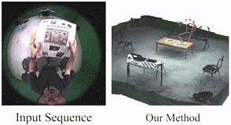

# SceneEgo

Official implementation of paper: 

**Scene-aware Egocentric 3D Human Pose Estimation**

*Jian Wang, Diogo Luvizon, Weipeng Xu, Lingjie Liu, Kripasindhu Sarkar, Christian Theobalt*

*CVPR 2023*



### Install

1. Create a new anaconda environment

```shell
conda create -n sceneego python=3.9

conda activate sceneego
```

2. Install pytorch 1.13.1 from https://pytorch.org/get-started/previous-versions/

3. Install other dependencies
```shell
pip install -r requirements.txt
```
### Run the demo

1. Download [pre-trained pose estimation model](https://nextcloud.mpi-klsb.mpg.de/index.php/s/DGB6XKEPwwQbmTi) and put it under ```models/sceneego/checkpoints```

2. run:
```shell
python demo.py --config experiments/sceneego/test/sceneego.yaml --img_dir data/demo/imgs --depth_dir data/demo/depths --output_dir data/demo/out --vis True
```
The result will be shown with the open3d visualizer and the predicted pose is saved at ```data/demo/out```.

3. The predicted pose is saved as the pkl file (e.g. ```img_001000.jpg.pkl```). To visualize the predicted result, run:
```shell
python visualize.py --img_path data/demo/imgs/img_001000.jpg --depth_path data/demo/depths/img_001000.jpg.exr --pose_path data/demo/out/img_001000.jpg.pkl
```
The result will be shown with the open3d visualizer.

[//]: # (### Test on real-world dataset)

[//]: # ()
[//]: # (1. Download [pre-trained pose estimation model]&#40;https://nextcloud.mpi-klsb.mpg.de/index.php/s/DGB6XKEPwwQbmTi&#41; and put it under ```models/sceneego/checkpoints```)

[//]: # ()
[//]: # ()
[//]: # (2. Download the test dataset from to ```data/sceneego```)

[//]: # ()
[//]: # (3. run:)

[//]: # (```shell)

[//]: # (python test.py --data_path data/sceneego)

[//]: # (```)


